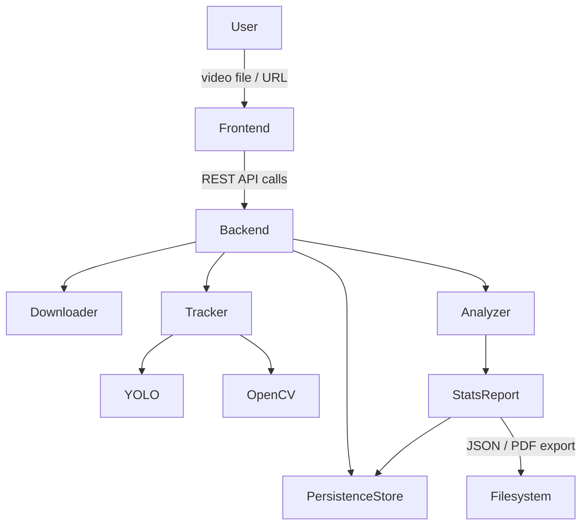
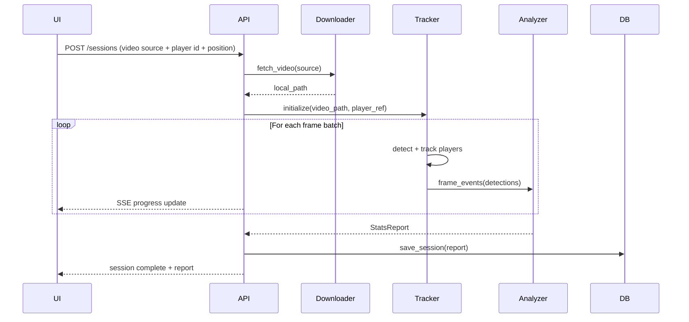

# Design Document: Soccer Player Tracker

## Overview

The Soccer Player Tracker is a local desktop application that processes soccer match footage to generate per-player performance statistics. Users supply a video (local file or URL), identify a target player (by jersey number or visual selection), specify their position, and receive a structured stats report covering touches, passes, ball losses, and position-specific advanced metrics.

The system runs entirely on the user's machine. On Apple Silicon Macs, PyTorch with Metal/MPS acceleration is used for GPU-accelerated inference. The architecture separates concerns into a Python backend (FastAPI) that handles all CV/ML processing and a lightweight browser-based frontend (HTML/JS) for the UI.



---

## Architecture

### High-Level Design

The application follows a client-server architecture running entirely locally:

- **Frontend**: Single-page HTML/JS application served by FastAPI's static file handler. Communicates with the backend via REST and Server-Sent Events (SSE) for progress streaming.
- **Backend**: FastAPI application exposing REST endpoints. Manages the full pipeline: video ingestion → player detection → tracking → stat computation → report generation.
- **CV Pipeline**: OpenCV handles frame extraction and image manipulation. Ultralytics YOLO models handle player and ball detection. ByteTrack maintains player identity across frames.
- **Storage**: SQLite database (via SQLAlchemy) stores session metadata and stats reports. Local runtime data is stored under `~/.soccer-tracker/` (`uploads/`, `cache/`, `exports/`, `exports/debug/`, `sessions.db`, `auth.json`).

### Processing Pipeline



### Device Selection

At startup the backend detects available compute:

```python
import torch
device = "mps" if torch.backends.mps.is_available() else "cuda" if torch.cuda.is_available() else "cpu"
```

YOLO inference and any PyTorch-based ReID models run on the selected device.

---

## Components and Interfaces

### 1. Downloader

Responsible for resolving video sources to a local file path.

```
download(source: str) -> DownloadResult
  source: local file path or URL
  returns: DownloadResult(local_path, duration_s, width, height)
  raises: UnsupportedFormatError, UnavailableSourceError, MalformedURLError
```

- Local files: validates extension (mp4, mov, avi, mkv), reads metadata via OpenCV.
- URLs: uses `yt-dlp` to download YouTube/Veo/other platform videos to `~/.soccer-tracker/cache`. Streams progress events.

### 2. Tracker

Wraps Ultralytics YOLO detection + ByteTrack multi-object tracking. Exposes a frame-by-frame iterator.

```
initialize(video_path: str, player_ref: PlayerRef) -> None
track_frames() -> Iterator[FrameResult]
  yields: FrameResult(frame_idx, timestamp_ms, player_box, ball_box, confidence, all_detections)
```

`PlayerRef` is a union type:
- `JerseyRef(number: int, color: Optional[str])` — OCR on detected jersey regions to find the player; if `color` is provided, HSV histogram matching on the player crop is used as a tiebreaker when multiple players share the same number or OCR is ambiguous
- `BBoxRef(x, y, w, h, bbox_timestamp_ms)` — user-drawn bounding box on the currently selected video frame; tracker locks onto that region/time reference

Confidence score per frame is the YOLO detection confidence for the target player's bounding box. If the player is not detected, confidence = 0.

### 3. Analyzer

Consumes the stream of `FrameResult` objects and accumulates statistics.

```
process_frame(frame: FrameResult) -> None
finalize(position: Position) -> StatsReport
```

Internal state machines:
- **Touch detector**: ball-to-player proximity threshold (configurable, default 50px at 1080p). Debounce window of 500ms (Req 4.2).
- **Pass detector**: tracks ball trajectory after a touch; classifies as successful pass if ball reaches a teammate bounding box, attempted pass if ball leaves player vicinity toward any direction.
- **Ball loss detector**: possession transfer to an opponent bounding box following a touch.
- **Position stats**: computed from accumulated frame data after full video processing.

### 4. Stats Report Builder

Assembles the final `StatsReport` from Analyzer output.

```
build(analyzer_state: AnalyzerState, session_meta: SessionMeta) -> StatsReport
export_pdf(report: StatsReport, path: str) -> None
export_json(report: StatsReport, path: str) -> None
```

PDF generation uses `reportlab` or `weasyprint`.

### 5. Persistence Layer

SQLite-backed store using SQLAlchemy.

```
save_session(report: StatsReport) -> SessionID
list_sessions() -> List[SessionSummary]
load_session(session_id: SessionID) -> StatsReport
delete_session(session_id: SessionID) -> None
```

### 6. YouTube Auth Manager

Handles Google OAuth2 flow and token lifecycle for authenticated YouTube downloads.

```
get_auth_url() -> str                  # Returns Google OAuth2 consent URL
exchange_code(code: str) -> None       # Exchanges auth code for token; saves to ~/.soccer-tracker/auth.json
get_credentials() -> Optional[Credentials]  # Returns valid credentials or None if not connected
revoke() -> None                       # Deletes stored token
is_connected() -> bool                 # Returns True if a valid (non-expired) token exists
```

- Uses `google-auth-oauthlib` for the OAuth2 flow and `google-auth` for token refresh.
- Tokens are stored at `~/.soccer-tracker/auth.json` and refreshed automatically when expired.
- The Downloader checks `YouTubeAuthManager.is_connected()` and passes credentials to `yt-dlp` via a cookies/token file when downloading YouTube URLs.
- Raises `AuthenticationError` if the OAuth flow fails or the token cannot be refreshed.

### 7. REST API (FastAPI)

| Method | Path | Description |
|--------|------|-------------|
| POST | `/sessions` | Start analysis asynchronously (`202` + `session_id`) |
| GET | `/sessions` | List saved sessions |
| GET | `/sessions/{session_id}` | Load a session report |
| DELETE | `/sessions/{session_id}` | Delete a session (`204`) |
| POST | `/sessions/{session_id}/cancel` | Cancel running analysis |
| POST | `/sessions/{session_id}/export` | Export report (`pdf`/`json`) |
| GET | `/sessions/{session_id}/clips` | List generated debug clips for a session |
| GET | `/sessions/{session_id}/clips/{clip_name}` | Download a debug clip |
| GET | `/sessions/{session_id}/progress` | SSE stream for progress/status updates |
| POST | `/upload` | Upload a local video file (also returns metadata) |
| DELETE | `/uploads` | Delete all files in the UploadStore |
| GET | `/uploads` | List uploaded files |
| GET | `/uploads/stream/{file_name}` | Stream an uploaded file |
| GET | `/video/metadata` | Get duration/resolution for URL sources |
| GET | `/video/frame0` | Return first frame as JPEG |
| GET | `/video/frame` | Return frame at timestamp as JPEG |
| GET | `/video/stream` | Stream full video content |
| GET | `/auth/youtube` | Initiate Google OAuth2 flow; redirects to Google consent screen |
| GET | `/auth/youtube/callback` | OAuth2 callback; exchanges code for token and stores it |
| DELETE | `/auth/youtube` | Disconnect YouTube account; deletes stored token |
| GET | `/auth/youtube/status` | Return current auth state (`connected` / `disconnected`) |

---

## Data Models

### VideoSource

```python
class VideoSource(BaseModel):
    type: Literal["file", "url"]
    path: str          # local path or URL string
```

### PlayerRef

```python
class PlayerRef(BaseModel):
    method: Literal["jersey", "bbox"]
    jersey_number: Optional[int]
    jersey_color: Optional[str]  # e.g. "red", "blue" — supplementary HSV color hint
    bbox: Optional[tuple[int, int, int, int]]  # x, y, w, h in selected-frame pixels
    bbox_timestamp_ms: Optional[int]  # selected video timestamp for bbox mode
```

### Position

```python
class Position(str, Enum):
    GOALKEEPER = "goalkeeper"
    DEFENDER = "defender"
    MIDFIELDER = "midfielder"
    FORWARD = "forward"
```

### TouchEvent

```python
class TouchEvent(BaseModel):
    timestamp_ms: int
    frame_idx: int
    confidence: float
```

### PassEvent

```python
class PassEvent(BaseModel):
    timestamp_ms: int
    attempted: bool
    successful: bool
```

### BallLossEvent

```python
class BallLossEvent(BaseModel):
    timestamp_ms: int
    frame_idx: int
    cause: Literal["tackle", "interception", "miscontrol"]
```

### CoreStats

```python
class CoreStats(BaseModel):
    touch_count: int
    touch_events: list[TouchEvent]
    passes_attempted: int
    passes_successful: int
    pass_completion_pct: Optional[float]   # None → "N/A"
    ball_losses: int
    ball_loss_events: list[BallLossEvent]
    ball_retention_rate: Optional[float]   # None → "N/A"
```

### AdvancedStats (union by position)

```python
class GoalkeeperStats(BaseModel):
    saves: int
    goals_conceded: int
    distribution_accuracy_pct: Optional[float]
    sweeper_actions: int

class DefenderStats(BaseModel):
    tackles_attempted: int
    tackles_won: int
    interceptions: int
    clearances: int
    aerial_duels_won: int

class MidfielderStats(BaseModel):
    key_passes: int
    through_balls: int
    distance_covered_m: float
    ball_recoveries: int

class ForwardStats(BaseModel):
    shots_on_target: int
    shots_off_target: int
    dribbles_attempted: int
    dribbles_completed: int
    off_ball_runs: int
```

### StatsReport

```python
class StatsReport(BaseModel):
    session_id: str
    created_at: datetime
    video_source: str          # path or URL
    player_ref: PlayerRef
    position: Position
    analysis_duration_s: float
    core: CoreStats
    advanced: Union[GoalkeeperStats, DefenderStats, MidfielderStats, ForwardStats]
    debug_clips: dict[str, list[str]]
    tracking_summary: dict[str, object]
    analyzer_diagnostics: dict[str, object]
```

### SessionSummary

```python
class SessionSummary(BaseModel):
    session_id: str
    created_at: datetime
    video_source: str
    player_ref: PlayerRef
    position: Position
```

### DownloadResult

```python
class DownloadResult(BaseModel):
    local_path: str
    duration_s: float
    width: int
    height: int
```

### FrameResult

```python
class FrameResult(BaseModel):
    frame_idx: int
    timestamp_ms: int
    player_box: Optional[tuple[int, int, int, int]]
    ball_box: Optional[tuple[int, int, int, int]]
    confidence: float
    all_detections: list[Detection]
```

---


## Correctness Properties

*A property is a characteristic or behavior that should hold true across all valid executions of a system — essentially, a formal statement about what the system should do. Properties serve as the bridge between human-readable specifications and machine-verifiable correctness guarantees.*

### Property 1: File Format Validation Completeness

*For any* file path string, the format validator should accept it if and only if its extension (case-insensitive) is one of {mp4, mov, avi, mkv}, and when rejecting it the error response should enumerate all accepted formats.

**Validates: Requirements 1.1, 1.3**

---

### Property 2: Video Metadata Presence

*For any* valid video file, the metadata extraction result should contain a duration greater than zero seconds and non-zero width and height values.

**Validates: Requirements 1.5, 2.6**

---

### Property 3: Malformed URL Rejection

*For any* string that is not a well-formed HTTP/HTTPS URL, the Downloader should return a `MalformedURLError` rather than attempting a network request.

**Validates: Requirements 2.3**

---

### Property 4: Frame Confidence Bounds

*For any* frame processed by the Tracker, the confidence score in the resulting `FrameResult` should be a float in the closed interval [0.0, 1.0].

**Validates: Requirements 3.7**

---

### Property 5: Tracking-Lost Alert Threshold

*For any* sequence of `FrameResult` objects where confidence < 0.5 for 30 or more consecutive frames, the Tracker should emit a tracking-lost alert event; for any sequence where no such run of 30 consecutive low-confidence frames exists, no alert should be emitted.

**Validates: Requirements 3.8**

---

### Property 6: Touch Debounce Invariant

*For any* sequence of ball-contact events, two contacts by the same player with timestamps within 500 milliseconds of each other should be counted as exactly one touch in the resulting `CoreStats`.

**Validates: Requirements 4.1, 4.2**

---

### Property 7: Touch Event Timestamps

*For any* `StatsReport`, every `TouchEvent` in `core.touch_events` should have a `timestamp_ms` value greater than or equal to zero and less than or equal to the video duration in milliseconds.

**Validates: Requirements 4.4**

---

### Property 8: Pass Completion Formula

*For any* `CoreStats` where `passes_attempted > 0`, `pass_completion_pct` should equal `round((passes_successful / passes_attempted) * 100, 1)` and should be in the range [0.0, 100.0]. When `passes_attempted == 0`, `pass_completion_pct` should be `None`.

**Validates: Requirements 5.4, 5.5**

---

### Property 9: Ball Retention Rate Formula

*For any* `CoreStats` where `touch_count > 0`, `ball_retention_rate` should equal `round(((touch_count - ball_losses) / touch_count) * 100, 1)` and should be in the range [0.0, 100.0]. When `touch_count == 0`, `ball_retention_rate` should be `None`.

**Validates: Requirements 6.4, 6.5**

---

### Property 10: Ball Loss Event Timestamps

*For any* `StatsReport`, every `BallLossEvent` in `core.ball_loss_events` should have a `timestamp_ms` value greater than or equal to zero and less than or equal to the video duration in milliseconds.

**Validates: Requirements 6.3**

---

### Property 11: Position-Specific Advanced Stats Completeness

*For any* `StatsReport`, the `advanced` field should be an instance of the stats model corresponding to `position`, and all required fields for that position should be present and non-null:
- Goalkeeper: `saves`, `goals_conceded`, `distribution_accuracy_pct`, `sweeper_actions`
- Defender: `tackles_attempted`, `tackles_won`, `interceptions`, `clearances`, `aerial_duels_won`
- Midfielder: `key_passes`, `through_balls`, `distance_covered_m`, `ball_recoveries`
- Forward: `shots_on_target`, `shots_off_target`, `dribbles_attempted`, `dribbles_completed`, `off_ball_runs`

**Validates: Requirements 7.3, 7.4, 7.5, 7.6, 7.7**

---

### Property 12: JSON Export Round-Trip

*For any* `StatsReport`, serializing it to JSON and then deserializing it should produce a `StatsReport` that is equal to the original (all fields match).

**Validates: Requirements 8.3**

---

### Property 13: Export Contains Required Metadata

*For any* exported `StatsReport` (JSON or PDF), the output should contain the video source reference, player identifier, and analysis timestamp.

**Validates: Requirements 8.4**

---

### Property 14: Analysis Duration Recorded

*For any* successfully completed analysis session, the `StatsReport.analysis_duration_s` field should be a positive float greater than zero.

**Validates: Requirements 9.5**

---

### Property 15: Session Persistence Round-Trip

*For any* `StatsReport` saved to the persistence layer, loading it by its `session_id` should return a report equal to the original.

**Validates: Requirements 10.1, 10.3**

---

### Property 16: Session Deletion Removes from List

*For any* saved session, after calling `delete_session(session_id)`, that `session_id` should not appear in the result of `list_sessions()`.

**Validates: Requirements 10.4**

### Property 17: Jersey Color Histogram Consistency

*For any* player crop image and a provided jersey color hint, the HSV histogram matching function should return a similarity score in the range [0.0, 1.0], where a score closer to 1.0 indicates a closer color match.

**Validates: Requirements 3.4, 3.6**

---

### Property 18: Upload Cleanup Completeness

*For any* set of files present in the UploadStore before calling `DELETE /uploads`, after the operation completes successfully, the UploadStore directory should contain zero files.

**Validates: Requirements 11.3, 11.6**

---

### Property 19: Auth Token Validity

*For any* stored YouTube auth token, `YouTubeAuthManager.is_connected()` should return `True` if and only if the token file exists and the token is not expired (or can be refreshed). After `revoke()` is called, `is_connected()` should always return `False`.

**Validates: Requirements 2.10, 2.12, 2.13**

---

## Error Handling

### Error Types

```python
class UnsupportedFormatError(Exception):
    accepted_formats: list[str]

class CorruptedFileError(Exception):
    file_path: str

class MalformedURLError(Exception):
    url: str

class UnavailableSourceError(Exception):
    url: str
    reason: str

class PlayerNotFoundError(Exception):
    player_ref: PlayerRef

class TrackingLostWarning(Warning):
    frame_idx: int
    consecutive_low_confidence_frames: int

class ExportError(Exception):
    export_format: str
    reason: str

class PersistenceError(Exception):
    reason: str

class AuthenticationError(Exception):
    reason: str  # e.g. "OAuth flow failed", "Token refresh failed", "Not authenticated"
```

### Error Handling Strategy

| Scenario | Component | Response |
|----------|-----------|----------|
| Unsupported file extension | Downloader | Raise `UnsupportedFormatError`; API returns 422 with accepted formats |
| Corrupted/unreadable file | Downloader | Raise `CorruptedFileError`; API returns 422 |
| Malformed URL | Downloader | Raise `MalformedURLError`; API returns 422 |
| Remote video unavailable | Downloader | Raise `UnavailableSourceError`; API returns 502 with reason |
| YouTube URL requires auth, not connected | Downloader | Raise `UnavailableSourceError` with reason "authentication required"; API returns 502 |
| OAuth flow failure | YouTubeAuthManager | Raise `AuthenticationError`; API returns 401 |
| Token expired / refresh failed | YouTubeAuthManager | Raise `AuthenticationError`; API returns 401; frontend prompts re-auth |
| Player not found in video | Tracker | Raise `PlayerNotFoundError`; API returns 422, prompts re-identification |
| Tracking confidence lost | Tracker | Emit `TrackingLostWarning` via SSE; analysis continues |
| Export failure | ReportBuilder | Raise `ExportError`; API returns 500; session data preserved |
| Storage unavailable | Persistence | Raise `PersistenceError`; API returns 507; offer export fallback |
| Analysis cancelled | Session | Set status=cancelled; discard partial results; return 200 with cancelled status |

All errors are logged to a local log file (`~/.soccer-tracker/app.log`) with timestamps and stack traces for debugging.

---

## Testing Strategy

### Current Test Coverage

The current repository emphasizes unit tests plus an end-to-end startup flow:
- Unit tests cover analyzer and report builder behavior.
- End-to-end tests cover app startup, async sessions (`202`), SSE progress, and debug clip retrieval.
- Property-based testing dependencies are installed, but the full property test suite in this design is mostly planned rather than implemented.

### Unit Tests

Current focus areas:
- Analyzer: touch/pass/loss/stat computation behavior (`tests/unit/test_analyzer.py`)
- Report builder: report build and export behavior (`tests/unit/test_report_builder.py`)
- App startup and pipeline orchestration are covered in e2e tests (`tests/e2e/test_app_startup.py`)

### Property-Based Tests (Design Targets)

Library: **Hypothesis** (Python)

Each property test should run a minimum of 100 iterations. Tests should be tagged with comments referencing the design property.

Configuration:
```python
from hypothesis import given, settings
settings.register_profile("ci", max_examples=100)
settings.load_profile("ci")
```

Property test mapping:

| Property | Test Description | Tag |
|----------|-----------------|-----|
| Property 1 | Generate random file extensions; verify accept/reject + error message | `Feature: soccer-player-tracker, Property 1: file format validation completeness` |
| Property 2 | Generate valid video file mocks; verify duration > 0 and resolution non-zero | `Feature: soccer-player-tracker, Property 2: video metadata presence` |
| Property 3 | Generate random non-URL strings; verify MalformedURLError raised | `Feature: soccer-player-tracker, Property 3: malformed URL rejection` |
| Property 4 | Generate random frame detection outputs; verify confidence in [0, 1] | `Feature: soccer-player-tracker, Property 4: frame confidence bounds` |
| Property 5 | Generate frame sequences with varying confidence patterns; verify alert emitted iff 30+ consecutive low-confidence frames | `Feature: soccer-player-tracker, Property 5: tracking-lost alert threshold` |
| Property 6 | Generate contact event sequences with random timestamps; verify debounce produces correct touch count | `Feature: soccer-player-tracker, Property 6: touch debounce invariant` |
| Property 7 | Generate random touch events; verify all timestamps in [0, video_duration_ms] | `Feature: soccer-player-tracker, Property 7: touch event timestamps` |
| Property 8 | Generate random (successful, attempted) pass counts; verify formula and N/A edge case | `Feature: soccer-player-tracker, Property 8: pass completion formula` |
| Property 9 | Generate random (touches, ball_losses) counts; verify formula and N/A edge case | `Feature: soccer-player-tracker, Property 9: ball retention rate formula` |
| Property 10 | Generate random ball loss events; verify all timestamps in [0, video_duration_ms] | `Feature: soccer-player-tracker, Property 10: ball loss event timestamps` |
| Property 11 | Generate random StatsReport for each position; verify advanced stats model type and field presence | `Feature: soccer-player-tracker, Property 11: position-specific advanced stats completeness` |
| Property 12 | Generate random StatsReport objects; verify JSON round-trip equality | `Feature: soccer-player-tracker, Property 12: JSON export round-trip` |
| Property 13 | Generate random StatsReport objects; verify exported JSON/PDF contains required metadata fields | `Feature: soccer-player-tracker, Property 13: export contains required metadata` |
| Property 14 | Generate random completed sessions; verify analysis_duration_s > 0 | `Feature: soccer-player-tracker, Property 14: analysis duration recorded` |
| Property 15 | Generate random StatsReport objects; save then load; verify equality | `Feature: soccer-player-tracker, Property 15: session persistence round-trip` |
| Property 16 | Generate random sessions; save then delete; verify absent from list | `Feature: soccer-player-tracker, Property 16: session deletion removes from list` |

### Test File Structure (Current + Planned)

```
tests/
  e2e/
    test_app_startup.py
  unit/
    test_analyzer.py
    test_report_builder.py
  property/
    __init__.py                    # property tests planned
    # planned:
    # test_format_validation.py      (Properties 1–3)
    # test_tracker_properties.py     (Properties 4–5)
    # test_analyzer_properties.py    (Properties 6–10)
    # test_report_properties.py      (Properties 11–14)
    # test_persistence_properties.py (Properties 15–16)
  conftest.py
```
